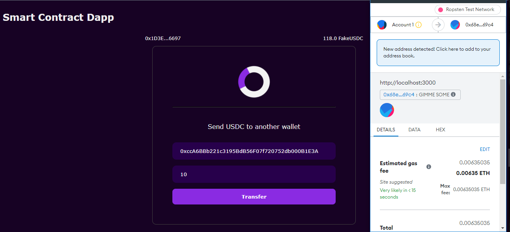

A web 3 Dapp built with Nextjs that interacts with a smart contract, send tokens from one address to another, and minting of tokens.

## Getting Started

Clone the repository:
``` git clone https://github.com/sparkle666/next-dapp ```
cd into next-dapp and run:
``` yarn install ```
Then, run the development server:

```bash
npm run dev
# or
yarn dev
```

Open [http://localhost:3000](http://localhost:3000) with your browser to see the result.

